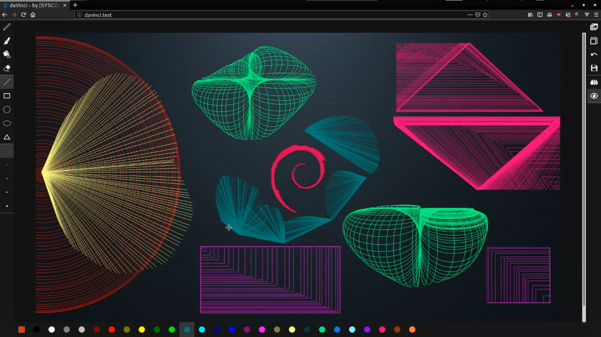

# DAVINCI by [SYSCOMz]
* Web based drawing program

## **DAVINCI** online:
<a href="https://bdostumski.github.io/davinci/">DAVINCI LIVE DEMO</a>
 
<a href="https://youtu.be/jfASHPJ5DmU">DAVINCI VIDEO DEMO</a>

  

## Requirements
**To work with the program you need to start it on a web server**
 
**<a href="https://hub.docker.com/repository/docker/bdostumski/davinci" target="_blank">[DOCKER]</a> docker run -it -d -p 8080:80 bdostumski/davinci:1.0.0** 
**[Vagrant] vagrant up**
  
**[Kubernetes Orchestration]**  
**minikube start --nodes=2**  
**kubectl apply -f davinci-deployment.yaml**  
**minikube service davinci-service**  

## To create DAVINCI I was using :
* HTML
* SASS
* JavaScript ES6
* NGINX Web Server

## **Program Design:**
**The program has four main sectors**
* Left -> Drawing Tools [ Pencil, Brush, Bucket, ... ]
* Right -> Main Commands [ Open, Save, Resize, Undo, ... ]
* Bottom -> Colors [ Predefined Colors, Custom Color ]
* Center -> Canvas [ Drawing Field ]

**Left -> Drawing Tools [ Pencil, Brush, Paint, Eraser, Line, Rectangle, Circle, Ellipse, Triangle, Size ]**
* **Stroke Size 1px - 5px** [ Pencil, Paint, Line, Rectangle, Circle, Ellipse, Triangle ]
* **Stroke Size 3px - 15px** [ Eraser, Brush ]

**Right -> Main Commands [ Open, Save, Resize, Undo, Fill Shape, Effects ]**
* **Open** [ You can start NEW DRAWING, get image from URL or BROWSE to the image stored in your local computer ]
* **Save** [ Will save your drawing to the local computer ]
* **Resize** [ You can resize the Canvas in Width / Height ]
* **Redu** [ You can redo mistakes to ten ]
* **Fill Shape** [ You can Fill Shapes with different colors for the Line, Rectangle, Circle, Ellipse, Triangle Tools ]
* **Effects** [ You can add Special Effects for the Line, Rectangle, Circle, Ellipse, Triangle Tools ]

*Images that are got from URL are protected by CORS ‘Access-Control-Allow-Origin’*

**Bottom -> Colors [Predefined Colors, Custom Color]**
* **Predefined Colors**
* **Custom Color**

**Center -> Canvas [ Drawing Field ]**
* **Canvas** [ Drawing Field ]
