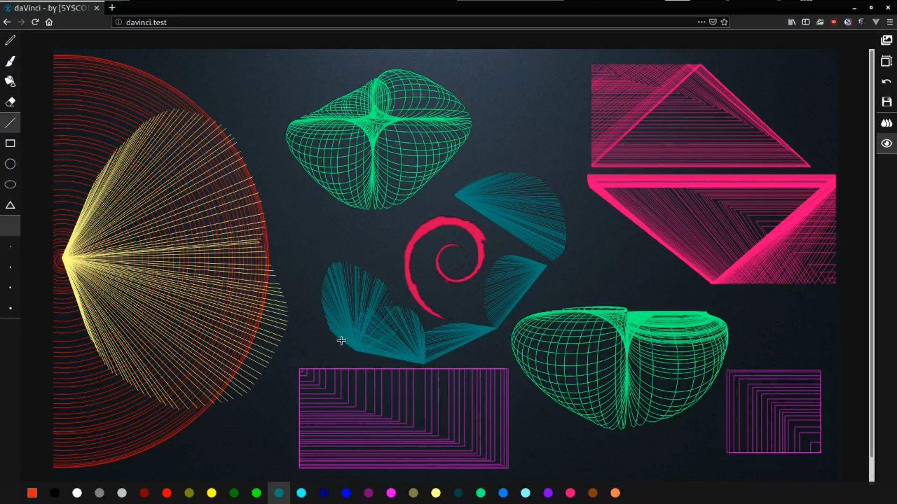

# 🎨 DAVINCI — Online Drawing Application

> A browser-based paint application built with vanilla JavaScript ES6, HTML5 Canvas API, and SASS.  
> Inspired by classic desktop paint programs, DAVINCI runs entirely in the browser with no frameworks or dependencies.

🔗 **[Live Demo](https://bdostumski.github.io/learning-javascript/)** &nbsp;|&nbsp; 🎬 **[Video Demo](https://youtu.be/jfASHPJ5DmU)**

<div align="center">
  
</div>

---

## 📌 About

**DAVINCI** is a fully functional online drawing application that demonstrates core JavaScript ES6 concepts including classes, modules, Canvas API manipulation, and event-driven programming. The project also showcases a complete deployment pipeline using Docker, Vagrant, and Kubernetes (Minikube).

---

## 🚀 Getting Started

The application must be served from a web server (not opened as a local file).

### 🐳 Docker
```bash
docker run -it -d -p 8080:80 bdostumski/davinci:1.0.0
```
Then open: [http://localhost:8080](http://localhost:8080)

### 📦 Vagrant
```bash
vagrant up
```

### ☸️ Kubernetes (Minikube)
```bash
minikube start --nodes=2
kubectl apply -f davinci-deployment.yaml
minikube service davinci-service
```

---

## 🛠️ Tech Stack

| Technology | Purpose |
|---|---|
| HTML5 | Application structure and Canvas element |
| SASS / CSS3 | Styling and responsive toolbox layout |
| JavaScript ES6 | Application logic (classes, modules, arrow functions, sets) |
| Canvas API | 2D drawing surface and pixel manipulation |
| NGINX | Static file web server |
| Docker | Containerised deployment |
| Vagrant | Local VM-based development environment |
| Kubernetes | Container orchestration with Minikube |

---

## 🖼️ Application Layout

The UI is divided into four main sections:

```
┌─────────────────────────────────────────────┐
│  LEFT          CENTER           RIGHT        │
│  Drawing       Canvas           Commands     │
│  Tools         (Drawing         (Open, Save, │
│  + Sizes       Field)           Undo, ...)   │
│─────────────────────────────────────────────│
│               BOTTOM — Colors                │
└─────────────────────────────────────────────┘
```

### 🖊️ Left Panel — Drawing Tools
| Tool | Stroke Size |
|---|---|
| Pencil | 1px – 5px |
| Brush | 3px – 15px |
| Paint Bucket | — |
| Eraser | 3px – 15px |
| Line | 1px – 5px |
| Rectangle | 1px – 5px |
| Circle | 1px – 5px |
| Ellipse | 1px – 5px |
| Triangle | 1px – 5px |

### ⚙️ Right Panel — Commands
| Command | Description |
|---|---|
| Open | New Drawing / Load from URL / Browse local file |
| Save | Exports canvas as a `.png` file |
| Resize | Resize the canvas width & height |
| Undo | Step back up to 10 actions |
| Fill Shape | Toggle fill color for closed shapes |
| Effects | Toggle trail/echo drawing effects |

### 🎨 Bottom Panel — Colors
- 27 predefined color swatches
- Custom color via native `<input type="color">` color picker

---

## 📁 Project Structure

```
learning-javascript/
│
├── index.html                  # Main application HTML
├── Dockerfile                  # Docker image definition (NGINX)
├── Vagrantfile                 # Vagrant VM configuration
├── bootstrap.sh                # VM provisioning script
├── davinci-deployment.yaml     # Kubernetes deployment + service manifest
│
├── scripts/
│   ├── main.js                 # Entry point — event listeners & tool switching
│   ├── paint.js                # Core Paint class — drawing engine
│   ├── fill.js                 # Fill class — flood fill algorithm
│   └── coords.js               # Utility — coordinate & distance helpers
│
├── styles/
│   └── main.css                # Compiled SASS stylesheet
│
└── images/
    └── paint/                  # Tool icons and favicon
```

---

## 🧠 Algorithms & Data Structures

### 1. 🪣 Flood Fill — Iterative Stack-Based BFS
**File:** `scripts/fill.js`  
**Used by:** Paint Bucket tool

The classic **flood fill** algorithm fills a contiguous region of pixels with a new color. Instead of a recursive approach (which risks stack overflow on large canvases), this implementation uses an **explicit stack array** to simulate BFS/DFS iteratively.

**How it works:**
1. On click, read the **target color** of the clicked pixel directly from `ImageData`.
2. Push the starting pixel onto `fillStack`.
3. In each iteration, pop a pixel — if its color matches the target, recolor it and push its 4 neighbours (up, down, left, right) onto the stack.
4. Continue until the stack is empty, then write the modified `ImageData` back to the canvas in one `putImageData()` call.

```
Time Complexity:  O(N) — where N is the number of pixels in the filled region
Space Complexity: O(N) — stack holds pending pixels
```

```javascript
// Iterative batch processing — processes all pending pixels per frame
replacementColor() {
    if (this.fillStack.length) {
        let range = this.fillStack.length;
        for (let i = 0; i < range; i++) {
            this.floodFill(this.fillStack[i][0], this.fillStack[i][1], this.fillStack[i][2]);
        }
        this.fillStack.splice(0, range);
        this.replacementColor(); // tail recursion over batches
    } else {
        this.ctx.putImageData(this.imageData, 0, 0);
    }
}
```

---

### 2. 🔁 Bounded Undo Stack (LIFO)
**File:** `scripts/paint.js`  
**Used by:** Undo command

A **stack (LIFO)** stores canvas snapshots (`ImageData`) before each stroke begins. The stack is bounded to **10 entries**; once full, the oldest entry is removed using `shift()` (sliding window).

```javascript
if (this.undoStack.length >= this.undoLimit) this.undoStack.shift(); // evict oldest
this.undoStack.push(this.ctx.getImageData(0, 0, w, h));             // push snapshot

// On undo:
this.ctx.putImageData(this.undoStack[this.undoStack.length - 1], 0, 0);
this.undoStack.pop();
```

```
Data Structure: Array used as a bounded stack
Max size:       10 snapshots
Eviction policy: FIFO on overflow (shift oldest), LIFO on undo (pop latest)
```

---

### 3. 📐 Parametric Rubber-Band Shape Preview
**File:** `scripts/paint.js` → `drawShape()`  
**Used by:** Line, Rectangle, Circle, Ellipse, Triangle tools

To show a real-time preview while the user drags, the canvas is **reset to a saved snapshot** on every `mousemove` event, then the shape is redrawn from scratch using the current mouse position. This is the standard **snapshot + redraw** pattern for interactive Canvas drawing.

```javascript
onMouseDown(e) {
    this.savedData = this.ctx.getImageData(0, 0, w, h); // snapshot before drag
}

drawShape() {
    this.ctx.putImageData(this.savedData, 0, 0); // restore clean canvas
    this.ctx.beginPath();
    // ... draw shape to current mouse position
    this.ctx.stroke();
}
```

This ensures no ghost trails appear during drag for shape tools.

---

### 4. 📏 Euclidean Distance for Circle Radius
**File:** `scripts/coords.js`  
**Used by:** Circle tool

The radius of the circle is computed as the **Euclidean distance** between the mouse-down point (center) and the current mouse position:

```
radius = √( (x₂ - x₁)² + (y₂ - y₁)² )
```

```javascript
export function Distance(startPosition, currentPosition) {
    return Math.sqrt(
        Math.pow(currentPosition.x - startPosition.x, 2) +
        Math.pow(currentPosition.y - startPosition.y, 2)
    );
}
```

---

### 5. 🖱️ Coordinate Normalisation
**File:** `scripts/coords.js`  
**Used by:** All drawing tools

Raw mouse events report coordinates relative to the **viewport**, not the canvas element. The `Coords()` function normalises these using `getBoundingClientRect()`:

```javascript
export function Coords(e, canvas) {
    const rect = canvas.getBoundingClientRect();
    return {
        x: e.clientX - rect.left,
        y: e.clientY - rect.top
    };
}
```

This ensures accurate drawing regardless of the canvas position on the page.

---

### 6. 🎨 Hex → RGBA Color Conversion
**File:** `scripts/fill.js`  
**Used by:** Paint Bucket tool

CSS hex color strings (e.g. `#FF5733`) must be converted to `[R, G, B, A]` arrays for direct `ImageData` pixel comparison and manipulation. This is done via **regex parsing + base-16 integer conversion**:

```javascript
hexToRGBA(hex) {
    var result = /^#?([a-f\d]{2})([a-f\d]{2})([a-f\d]{2})$/i.exec(hex);
    return [
        parseInt(result[1], 16), // R
        parseInt(result[2], 16), // G
        parseInt(result[3], 16), // B
        255                      // A (fully opaque)
    ];
}
```

---

## 👤 Author

**Borislav Aleksandrov Dostumski** 
GitHub: [@bdostumski](https://github.com/bdostumski)

---

## 📄 License

This project is open source and available for learning purposes.

---

## 🏷️ Topics

`javascript` `ecmascript6` `drawing-app` `paint-application` `drawing-on-canvas` `drawing-online` `paint-app` `drawing-application`
